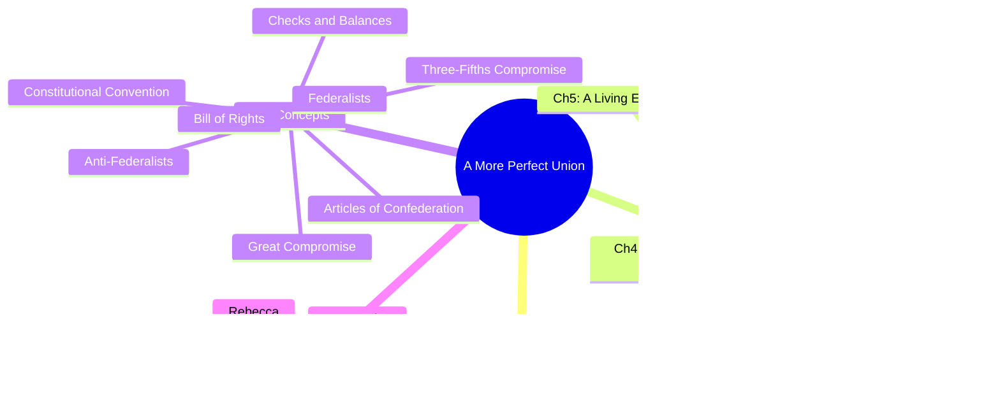

# Mind Map: A More Perfect Union

```mermaid
mindmap
  root((A More Perfect Union))
    Time Period
      1787-1789
    Chapters
      Ch1: The Articles of Confederation Fail
      Ch2: The Great Compromise
      Ch3: The Constitution's Framework
      Ch4: Ratification and the Bill of Rights
      Ch5: A Living Experiment
    Key Concepts
      Constitutional Convention
      Articles of Confederation
      Great Compromise
      Three-Fifths Compromise
      Federalists
      Anti-Federalists
      Bill of Rights
      Checks and Balances
    Perspective
      Rebecca
```

## How to Render

1. Copy the mermaid code block above
2. Paste into [Mermaid Live Editor](https://mermaid.live/)
3. Download as PNG or SVG
